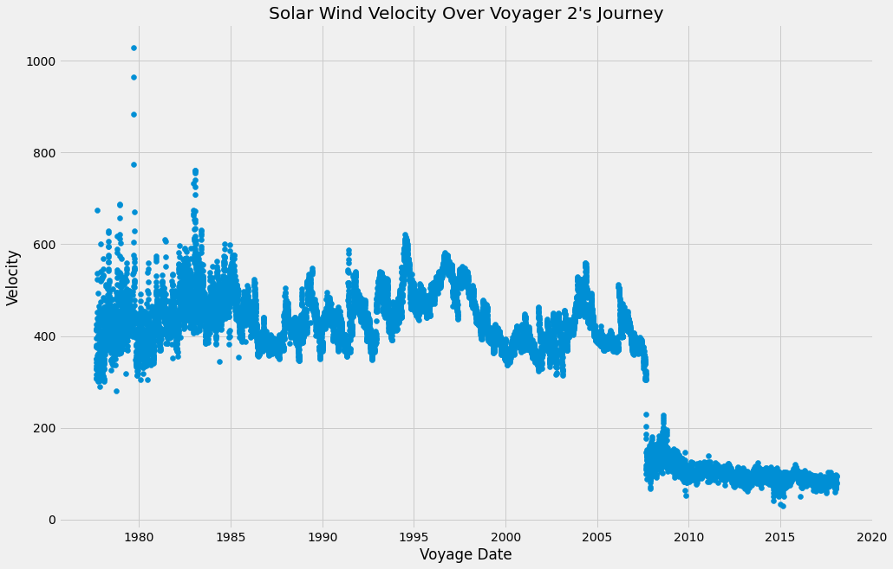

# Voyager 2 and the solar wind


```python
from common.chart_helper import *
```


```python
column_names = [
    "DECIMAL YEAR",
    "DAY OF YEAR",
    "V2 ANGLE",
    "V2 HELIOLATITUDE",
    "EARTH HELIOLATITUDE"
    "V2 HELIOLONGITUDE",
    "EARTH HELIOLONGITUDE",
    "VR",
    "VT",
    "VN",
    "DEN MOMENT",
    "DEN FIT",
    "W MOMENT",
    "W FIT",
    "R"]
```


```python
df = pd.read_csv('/Users/martinbell/analysis/voyager/source/VG2-SS-PLS-4-SUMM-1DAY-AVG-V1.0/DATA/2018_021_AUG.TAB', sep='\s+', header = None, names = column_names, index_col=False)
```


```python
# convert decimal year into date

df["DECIMAL YEAR"] = df["DECIMAL YEAR"].astype(int) + 1900
df["DAY OF YEAR"] = df["DAY OF YEAR"].astype(int)
df["DAY OF YEAR"] = df["DECIMAL YEAR"].astype(str) + df["DAY OF YEAR"].astype(str)
df["DAY OF YEAR"] = pd.to_datetime(df["DAY OF YEAR"], format="%Y%j")

```


```python
# set chart attributes
fig, ax = plt.subplots(dpi=72)
ax.set_title("Solar Wind Density Over Voyager 2's Journey")
ax.set_xlabel("Voyage Date")
ax.set_ylabel("Density cm^3")
plt.scatter("DAY OF YEAR", "DEN MOMENT", data=df);
```




